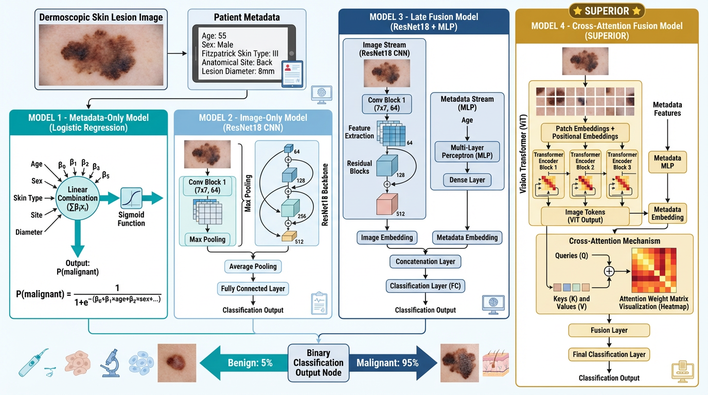

# Cross-Attention Enables Context-Aware Multimodal Skin Lesion Diagnosis

Official repository for the paper:

**Cross-Attention Enables Context-Aware Multimodal Skin Lesion Diagnosis**  
**Krishna Mridha**, **Humayera Islam**  
Case Western Reserve University, University of Chicago

## 📋 Abstract

Clinical diagnosis of skin lesions is inherently context-aware: dermatologists interpret lesion morphology together with patient-specific factors such as age, anatomical location, lesion diameter, and skin phenotype. However, many deep learning systems for skin lesion classification rely on images alone and do not explicitly model structured clinical metadata.

In this work, we propose a **context-aware multimodal deep learning framework** that integrates dermoscopic images with structured patient metadata using a **metadata-guided cross-attention mechanism**. Rather than appending metadata only at the final prediction stage, the proposed model allows metadata tokens to guide attention over spatial image features extracted by a Vision Transformer. We compare this approach against metadata-only, image-only, and late-fusion baselines. Results on the **PAD-UFES-20** dataset show that cross-attention yields the strongest overall performance (AUC 0.9818) and improved calibration (ECE 0.0379), highlighting that **how metadata is integrated matters as much as whether it is included**.

---

## 📑 Table of Contents

- [Overview](#-overview)
- [Key Contributions](#-key-contributions)
- [Dataset](#-dataset)
- [Model Architectures](#-model-architectures)
- [Installation](#-installation)
- [Usage](#-usage)
- [Results](#-results)
- [Interpretability](#-interpretability)
- [Citation](#-citation)
- [License](#-license)

---

## 🔍 Overview

This repository contains code for:

- Metadata-only baseline (logistic regression)
- Image-only baseline (ResNet18)
- Multimodal late-fusion baseline (feature concatenation)
- Proposed **cross-attention multimodal model** (ViT + metadata-guided attention)
- Training and evaluation pipelines
- Bootstrap comparison analysis
- Ablation studies on metadata features
- Attention visualization and interpretability analysis

---

## 🎯 Key Contributions

1. **Context-aware architecture**: Novel multimodal framework integrating dermoscopic images with structured clinical metadata through metadata-guided cross-attention
2. **Systematic comparison**: Evaluation across four modeling strategies to quantify the benefit of explicit cross-modal interaction
3. **Tokenized metadata representation**: Handles heterogeneous categorical and numerical variables while explicitly modeling missingness
4. **Interpretability analyses**: Feature ablation, cross-attention visualization, metadata perturbation, and case-based examination

---

## 📊 Dataset

We use the **PAD-UFES-20** dataset, a clinically annotated collection of smartphone-acquired dermoscopic images from Brazilian dermatology clinics.

### Dataset Statistics

| Attribute | Value |
|-----------|-------|
| Total lesions | 1,568 |
| Malignant | 1,089 (69%) |
| Benign | 479 (31%) |
| Patient-level split | 80% train / 20% test |

### Clinical Metadata

| Variable | Type | Categories/Range |
|----------|------|-------------------|
| Age | Numerical (continuous) | 18-95 years |
| Sex | Categorical (binary) | Male, Female |
| Fitzpatrick skin type | Categorical | I-VI |
| Anatomical site | Categorical | 5 locations |
| Lesion diameter | Numerical (continuous) | 2-50 mm |

---

## 🏗 Model Architectures

### Figure 1: Multimodal Framework

  

**Figure 1.** Overview of the multimodal framework for context-aware skin lesion classification. The model integrates dermoscopic images with structured clinical metadata (age, sex, Fitzpatrick skin type, anatomical site, and lesion diameter). Four modeling strategies are evaluated:  
(1) metadata-only logistic regression,  
(2) image-only convolutional neural network (ResNet18),  
(3) multimodal late fusion through feature concatenation, and  
(4) the proposed **cross-attention multimodal architecture**.
