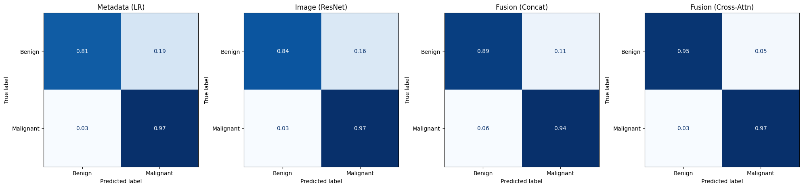

# Cross-Attention Enables Context-Aware Multimodal Skin Lesion Diagnosis

Official repository for the paper:

**Cross-Attention Enables Context-Aware Multimodal Skin Lesion Diagnosis**  
**Krishna Mridha**, **Humayera Islam**  
Case Western Reserve University, University of Chicago


## 📋 Abstract

Clinical diagnosis of skin lesions is inherently context-aware: dermatologists interpret lesion morphology together with patient-specific factors such as age, anatomical location, lesion diameter, and skin phenotype. However, many deep learning systems for skin lesion classification rely on images alone and do not explicitly model structured clinical metadata.

In this work, we propose a **context-aware multimodal deep learning framework** that integrates dermoscopic images with structured patient metadata using a **metadata-guided cross-attention mechanism**. Rather than appending metadata only at the final prediction stage, the proposed model allows metadata tokens to guide attention over spatial image features extracted by a Vision Transformer. We compare this approach against metadata-only, image-only, and late-fusion baselines. Results on the **PAD-UFES-20** dataset show that cross-attention yields the strongest overall performance (AUC 0.9818) and improved calibration (ECE 0.0379), highlighting that **how metadata is integrated matters as much as whether it is included**.

---

## 📑 Table of Contents

- [Overview](#-overview)
- [Key Contributions](#-key-contributions)
- [Dataset](#-dataset)
- [Model Architectures](#-model-architectures)
- [Installation](#-installation)
- [Results](#-results)
- [Interpretability](#-interpretability)
- [Citation](#-citation)
- [License](#-license)

---

## 🔍 Overview

This repository contains code for:

- Metadata-only baseline (logistic regression)
- Image-only baseline (ResNet18)
- Multimodal late-fusion baseline (feature concatenation)
- Proposed **cross-attention multimodal model** (ViT + metadata-guided attention)
- Training and evaluation pipelines
- Bootstrap comparison analysis
- Ablation studies on metadata features
- Attention visualization and interpretability analysis

---

## 🎯 Key Contributions

1. **Context-aware architecture**: Novel multimodal framework integrating dermoscopic images with structured clinical metadata through metadata-guided cross-attention
2. **Systematic comparison**: Evaluation across four modeling strategies to quantify the benefit of explicit cross-modal interaction
3. **Tokenized metadata representation**: Handles heterogeneous categorical and numerical variables while explicitly modeling missingness
4. **Interpretability analyses**: Feature ablation, cross-attention visualization, metadata perturbation, and case-based examination

---

## 📊 Dataset

We use the **PAD-UFES-20** dataset, a clinically annotated collection of smartphone-acquired dermoscopic images from Brazilian dermatology clinics.

### Dataset Statistics

| Attribute | Value |
|-----------|-------|
| Total lesions | 1,568 |
| Malignant | 1,089 (69%) |
| Benign | 479 (31%) |
| Patient-level split | 80% train / 20% test |

### Clinical Metadata

| Variable | Type | Categories/Range |
|----------|------|-------------------|
| Age | Numerical (continuous) | 18-95 years |
| Sex | Categorical (binary) | Male, Female |
| Fitzpatrick skin type | Categorical | I-VI |
| Anatomical site | Categorical | 5 locations |
| Lesion diameter | Numerical (continuous) | 2-50 mm |

---

## 🏗 Model Architectures

### Figure 1: Multimodal Framework

<p align="center">
  
</p>

**Figure 1.** Overview of the multimodal framework for context-aware skin lesion classification. The model integrates dermoscopic images with structured clinical metadata (age, sex, Fitzpatrick skin type, anatomical site, and lesion diameter). Four modeling strategies are evaluated:  
(1) metadata-only logistic regression,  
(2) image-only convolutional neural network (ResNet18),  
(3) multimodal late fusion through feature concatenation, and  
(4) the proposed **cross-attention multimodal architecture**. In the proposed model, metadata tokens attend to visual tokens extracted by a Vision Transformer, enabling metadata-guided interpretation of lesion morphology prior to classification.

---

### 1. Metadata-Only Model (Baseline)
Predicts malignancy risk using structured clinical variables without image information.

- **Input:** Standardized numerical variables (age, lesion diameter) and one-hot encoded categorical variables (sex, Fitzpatrick skin type, anatomical site)
- **Feature Vector:** $x_{meta} = [\tilde{x}_{num}; \psi_{sex}; \psi_{skin}; \psi_{site}] \in \mathbb{R}^{15}$
- **Architecture:** Logistic Regression
- **Output:** $P(y=1|x_{meta}) = \sigma(w^T x_{meta} + b)$

---

### 2. Image-Only Model (Baseline)
Predicts malignancy directly from dermoscopic images using a convolutional neural network.

- **Input:** Dermoscopic images resized to $224 \times 224$ pixels, normalized with ImageNet statistics
- **Architecture:** ResNet18 (excluding final classification layer)
- **Feature Extraction:** $h_{img} = \phi_{ResNet}(resize(I)) \in \mathbb{R}^{512}$
- **Residual Block Update:** $h^{(l+1)} = h^{(l)} + \mathcal{F}(h^{(l)}; W^{(l)})$
- **Output:** $P(y=1|I) = \sigma(w_{img}^T h_{img} + b_{img})$

---

### 3. Late Fusion Multimodal Model
Integrates image features and clinical metadata through feature-level concatenation.

- **Image Features:** $h_{img} \in \mathbb{R}^{512}$ (from ResNet18 encoder)
- **Metadata Features:** $x_{meta} \in \mathbb{R}^{15}$ (standardized numerical + one-hot categorical)
- **Fusion:** $h_{fused} = [h_{img}; x_{meta}] \in \mathbb{R}^{527}$
- **Classifier:** Logistic layer on fused representation
- **Limitation:** Interactions between clinical variables and spatial image features are modeled only implicitly through the final classifier

---

### 4. Proposed Cross-Attention Multimodal Model
Integrates visual and metadata representations through metadata-guided cross-attention.

#### Image Encoder
- Pretrained Vision Transformer (ViT-B/16)
- Retains full sequence of transformer tokens (class + patch tokens) to preserve spatial information
- Output: $H_{img} \in \mathbb{R}^{T_{img} \times d}$

#### Metadata Encoder
- Categorical variables (sex, Fitzpatrick type, anatomical site): dedicated embedding layers → projected to latent space $d$
- Numerical variables (age, lesion diameter): normalized + binary missingness indicators → projected to metadata token
- Output: $H_{meta} \in \mathbb{R}^{T_{meta} \times d}$

#### Cross-Attention Fusion
Metadata tokens act as queries; visual tokens serve as keys and values:

$$
H'_{meta} = \text{softmax}\left(\frac{(H_{meta}W_Q)(H_{img}W_K)^T}{\sqrt{d_k}}\right)(H_{img}W_V)
$$

- Enables each metadata token to selectively attend to spatial regions of the lesion representation
- Patient-specific clinical information dynamically guides which visual patterns are emphasized

#### Prediction Head
1. Residual update + layer normalization: $H'_{meta} \leftarrow \text{LayerNorm}(H_{meta} + H'_{meta})$
2. Feed-forward refinement: $H''_{meta} \leftarrow \text{FFN}(H'_{meta})$
3. Mean pooling: $h_{meta} = \text{MeanPool}(H''_{meta})$
4. Concatenate with CLS token: $h_{fused} = [h_{cls}; h_{meta}]$
5. Final prediction: $\hat{y} = \sigma(\text{MLP}(h_{fused}))$

---

### Algorithm 1: Forward Pass of Metadata-Guided Cross-Attention Model

```text
Require: Image I, numerical metadata x_num, missingness mask x_miss, categorical metadata x_cat
1:  Extract visual tokens using Vision Transformer
2:  H_img ← ϕ_ViT(I)
3:  Construct metadata tokens
4:  H_meta ← MetadataTokenizer(x_num, x_miss, x_cat)
5:  Compute cross-attention
6:  H_attn ← MHA(Q=H_meta, K=H_img, V=H_img)
7:  Residual update
8:  H'_meta ← LayerNorm(H_meta + H_attn)
9:  Feed-forward refinement
10: H''_meta ← FFN(H'_meta)
11: Aggregate metadata tokens
12: h_meta ← MeanPool(H''_meta)
13: Concatenate with CLS token
14: h_fused ← [h_cls; h_meta]
15: Predict malignancy probability
16: ŷ ← σ(MLP(h_fused))
```

---

## 🛠 Installation

### Requirements

- Python 3.8+
- PyTorch 1.9+
- torchvision
- pandas
- scikit-learn
- matplotlib
- seaborn

### Setup

```bash
# Clone the repository
git clone https://github.com/krishna-mridhacase/multimodal-skin-lesion-cross-attention.gitt
cd context-aware-skin-lesion

# Create virtual environment
python -m venv venv
source venv/bin/activate  # On Windows: venv\Scripts\activate

# Install dependencies
pip install -r requirements.txt
```

---


### Hyperparameters

The models are optimized using the following default settings (as per the study):

- **Optimizer:** AdamW
- **Learning Rate:** 3 × 10⁻⁴
- **Weight Decay:** 10⁻⁴
- **Scheduler:** ReduceLROnPlateau (based on validation PR AUC)
- **Loss:** Binary Cross-Entropy with Logits (Label Smoothing applied)
- **Sampling:** Weighted random sampler to address class imbalance (69% malignant)

---

## 📈 Results

### Main Clinical Performance

The cross-attention model achieves superior discrimination and calibration compared to baselines.

**Table 1.** Clinical performance comparison across models.

| Model | AUC | AUPRC | ECE | Precision | Recall | F1 | Brier Score |
| :--- | :--- | :--- | :--- | :--- | :--- | :--- | :--- |
| Metadata (LR) | 0.9491 | 0.9737 | 0.0845 | 0.9398 | 0.9750 | 0.9571 | 0.0519 |
| Image (ResNet) | 0.9776 | 0.9921 | 0.0505 | 0.9472 | 0.9708 | 0.9588 | 0.0538 |
| Fusion (Concat) | 0.9717 | 0.9910 | 0.0529 | 0.9615 | 0.9375 | 0.9494 | 0.0659 |
| **Fusion (Cross-Attn)** | **0.9818** | **0.9924** | **0.0379** | **0.9831** | **0.9708** | **0.9769** | **0.0323** |

### Statistical Comparison

Paired bootstrap comparison (B=2000 resamples) indicates that while cross-attention provides the best empirical performance, gains over strong unimodal baselines are modest on this dataset.

**Table 2.** Paired bootstrap comparison of model performance.

| Comparison | ∆AUC | % Gain | 95% CI | p-value |
| :--- | :--- | :--- | :--- | :--- |
| Fusion (Concat) vs Metadata | +0.0224 | 2.36% | (-0.0137, 0.0651) | 0.2620 |
| Fusion (Concat) vs Image | -0.0059 | -0.60% | (-0.0142, 0.0027) | 0.1670 |
| Cross-Attn vs Fusion (Concat) | +0.0102 | 1.05% | (-0.0105, 0.0304) | 0.3190 |
| **Cross-Attn vs Image** | **+0.0044** | **0.45%** | **(-0.0192, 0.0257)** | **0.6870** |

### Training Dynamics

<p align="center">
  
</p>

**Figure 2.** (a) Training and validation loss curves demonstrating stable convergence. (b) ROC curves comparing four modeling approaches. (c) Precision–recall curves illustrating model performance under class imbalance.

### Confusion Matrices

<p align="center">
  
</p>

**Figure 3.** Normalized confusion matrices. The cross-attention model achieves the highest specificity, reducing false positives for benign lesions (0.05) compared with baselines, while maintaining a low false negative rate for malignant lesions (0.03).

### Clinical Feature Importance

Ablation analysis reveals which patient variables contribute most to diagnostic improvement.

**Table 3.** Clinical Feature Importance via Ablation.

| Configuration | AUC | AUPRC |
| :--- | :--- | :--- |
| **Full model (all metadata)** | **0.9911** | **0.9969** |
| Remove anatomical site | 0.9918 (+0.0007) | 0.9970 (+0.0001) |
| Remove sex | 0.9899 (-0.0011) | 0.9962 (-0.0008) |
| Remove lesion diameter | 0.9873 (-0.0038) | 0.9922 (-0.0048) |
| Remove Fitzpatrick skin type | 0.9832 (-0.0079) | 0.9932 (-0.0037) |
| Remove age | 0.9802 (-0.0109) | 0.9920 (-0.0050) |
| Image only (no metadata) | 0.9777 (-0.0134) | 0.9928 (-0.0041) |

*Note: Lesion diameter provides the greatest contribution among metadata features, consistent with clinical teaching that larger lesions warrant greater suspicion.*

---

## 🔍 Interpretability

To understand how clinical context influences visual decision-making, we provide tools for explainability analysis.

### Cross-Attention Visualization

<p align="center">
  
</p>

**Figure 4.** Qualitative analysis of cross-attention maps. Brighter regions indicate higher attention weights. Correct predictions generally show attention focused on lesion structures, whereas misclassified samples exhibit more diffuse attention patterns.

### Analysis Tools

- **Attention Maps:** Visualize how metadata tokens interact with spatial image features.
- **Metadata Perturbation:** Quantify sensitivity of predictions to clinical variables by systematically modifying metadata while keeping the image fixed.
- **Case-Based Examination:** Inspect representative examples of correct and incorrect predictions jointly with attention visualizations.

---

## 📜 Citation

If you use this code or dataset in your research, please cite the following paper:

```bibtex
@article{mridha2024cross,
  title={Cross-Attention Enables Context-Aware Multimodal Skin Lesion Diagnosis},
  author={Mridha, Krishna and Islam, Humayera},
  journal={American Medical Informatics Association Submission},
  year={2026},
  affiliation={Case Western Reserve University; University of Chicago}
}
```

---

## 📄 License

This project is licensed under the MIT License - see the [LICENSE](LICENSE) file for details.

---

## 🤝 Contact

For questions or collaborations, please contact:
- **Krishna Mridha**: kxm828@case.edu
- **Humayera Islam**: hikf3@mail.missouri.edu

